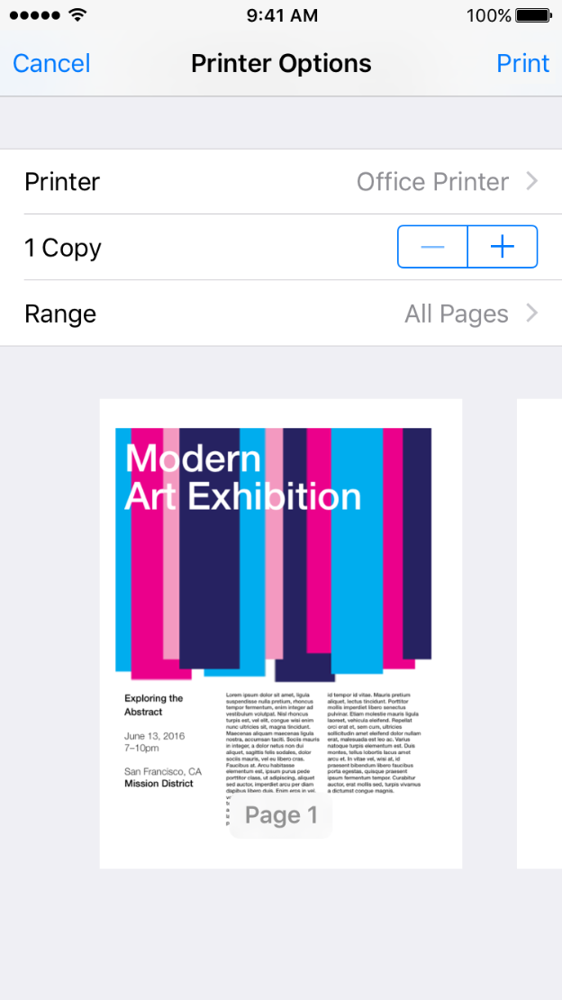

# 打印

你的应用可以利用系统内置的 AirPrint 技术将图片、PDF和其他内容打印到兼容打印机上。在启用 AirPrint 功能的应用上查看可打印的内容时，用户通常是点击在导航栏或工具栏上的一个操作按钮然后点击打印操作来显示一个打印预览。这个视图提供了可用打印机列表和任何可自定义的选项，例如打印的份数和页面范围，并且提供一个按钮来初始化打印。

**让打印操作容易被发现。**如果你的应用有工具栏或者导航栏，就通过系统提供的操作按钮来启用打印。用户比较熟悉这个按钮，而且在其他应用中用来打印。如果你的应用没有工具栏或导航栏，那就设计一个自定义按钮来替代。

**只有当可以打印的时候，才启用打印功能。**如果屏幕上没有任何内容可打印或者没有可用的打印机，不要显示一个打印按钮，因为用户会点击这个按钮。如果你的应用实现了自定义打印按钮，当打印功能不可用时，取消或者隐藏这个打印按钮。

**提供有用的打印可选项。**想想看，用户可能想要指定他何时打印内容。考虑诸如打印页面范围或者多份打印的可选项。启用额外的诸如前后打印功能的可选项，如果打印机支持的话。

针对开发者指南，请参见针对 [iOS 的绘制和打印指南](https://developer.apple.com/library/content/documentation/2DDrawing/Conceptual/DrawingPrintingiOS/Introduction/Introduction.html)和 [UIPrintInteractionController](https://developer.apple.com/documentation/uikit/uiprintinteractioncontroller)。

