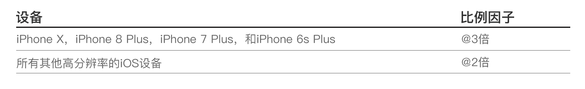

#图像尺寸和分辨率

iOS系统用于在屏幕上放置内容的坐标是基于以点为单位的测量值，这些点映射到显示器中的像素。在标准分辨率屏幕上，一个点等于一个像素。高分辨率屏幕具有更高的像素密度。由于在相同数量的物理空间中有更多像素，所以每个点上有更多的像素。因此，高分辨的显示器需要具有更多像素的图像。

 

**为您应用支持的所有设备提供应用中所有作品的高分辨率图片。**取决于设备，你可以通过将每个图像中的像素数量乘以特定比例因子来实现此目的。标准分辨率图像的比例因子是1.0，被称为@1x图像。高分辨率图像的比例因子为2.0和3.0，被称为@2x和@3x图像图像。例如，假设你的标准分辨率@1x图像大小是100px x 100px,该图像的@2x版本是200px × 200px。@3x版本将是300px × 300px。

 

#设计高分辨率图稿
**使用8像素 x 8像素网稿。**网格保持线条锐利，并确保内容在各种尺寸下都尽可能的清晰，不需要修饰和锐化。将图像边界捕捉到网格，最大限度的减小在缩放时产生的半像素和模糊的细节。

 
**以适当的格式制作作品。**通常，对位图/栅格图稿使用去隔行PNG文件。PNG支持透明度，并且因为它是无损的，所以压缩伪像不会模糊重要细节或更改颜色。对于需要阴影，纹理和高光效果的复杂作品来说，这是一个不错的选择。使用JPEG照片。它的压缩算法通常产生比无损格式更小的尺寸，并且伪像在照片中更难辨别。然而，照片般逼真的应用程序图标看起来最适合PNG。将PDF用于需要高分辨率缩放的字形和其他平面，矢量图形。

 
**使用不需要全部24位颜色的PNG图形的8位调色板。**使用8位调色板可以减小文件大小而不会降低图像质量。此调色板不适合照片。

 
**优化JPG文件在尺寸和质量之间找到平衡点。**大多数JPEG文件都可以进行压缩而不会显得降低所得图像。即使少量的压缩也可以节省大量的磁盘空间。试验每个图像上的压缩设置，找到可产生可接受结果的最佳值。

 
**为图像和图标提供代替文字标签。** 替代文字标签在屏幕上不可见，但他们让旁白者可听见地描述屏幕上的内容，让视觉障碍人士更轻松地进行导航。