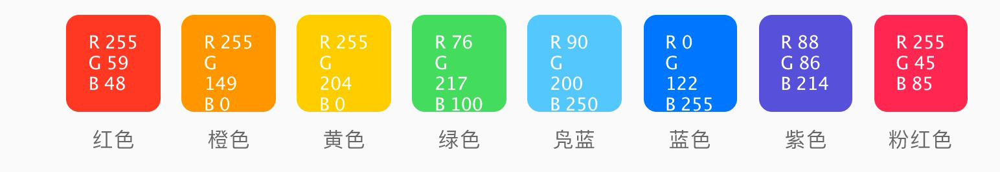
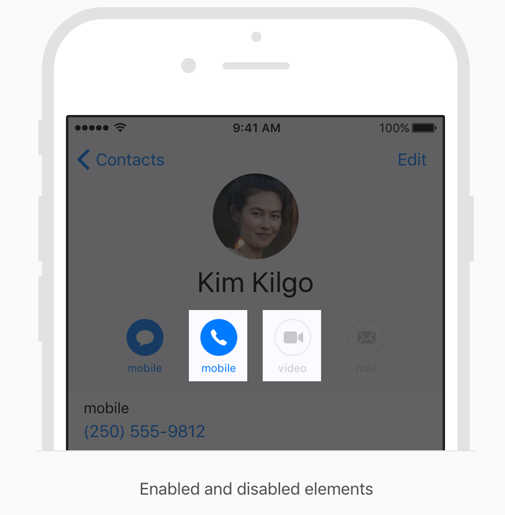
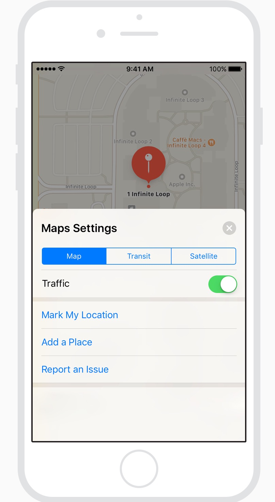
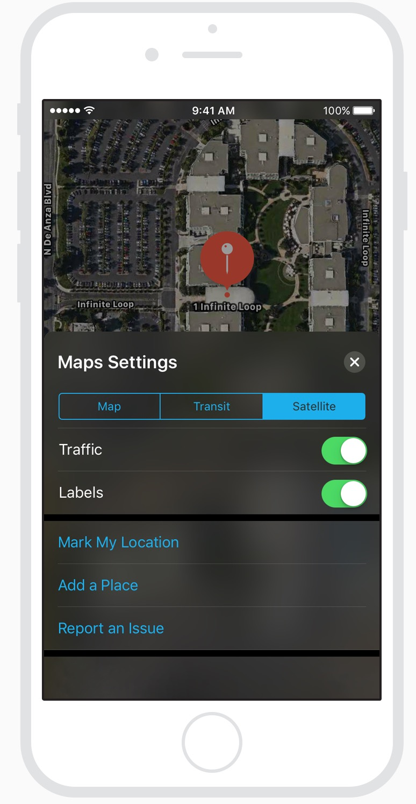
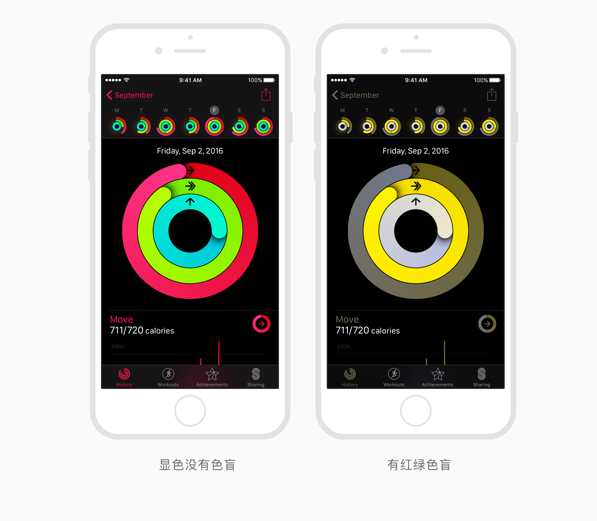

# 颜色
颜色是传递生命力，提供视觉连续性，沟通状态信息，响应用户操作的反馈并帮助人们可视化数据的好方法。在浅色和深色的两个背景下，当你选择应用色彩的颜色搭配时，看看系统颜色组合的搭配。

  
  
**明智的使用颜色来交流。**颜色的力量唤起重要信息的注意，要更加谨慎的使用。例如，一个红色三角形警告人们一个危险问题变成不那么有效，原因是在应用程序别的地方使用了红色。

 
**在您的应用程序使用互补色。**你的应用程序的颜色应该一起工作的，而不是冲突和分散注意力，如果粉彩是你应用程序风格的要素，例如，请使用协调一整套的粉色。

 
**一般来说，选择与你应用程序 logo 相协调的有限调色盘。**颜色的微妙使用是传达你商标的绝佳方式。

 
**考虑选择一个关键的颜色来指示你整个应用程序的交互性。**在便笺中，交互性的元素是黄色，在日历中，交互性的元素是红色，如果你要规定交互性的关键颜色，请确保其他颜色不与之竞争。

                                        
        

 
**避开使用相同的颜色做为交互式的和不交互式的元素。**如果交互式和不交互式的元素是同一个颜色，人们很难知道从哪里点击。

 
**考虑艺术品和半透明度对附近颜色的影响。**艺术品的变化有时保证附近颜色改变，是为了维持视觉上的连续性，和防止界面元素成为压倒性的或平庸的。地图，例如，地图在使用模式时显示为浅色方案，但是在激活卫星切换成深色的。而且当放置在半透明度的后面时，或者应用于半透明元素时，比如工具栏，颜色显现也不同。

 
浅色搭配 

 
深色搭配

 
**测试你的应用程序的颜色在各种的照明条件下的色彩搭配。**照明在室内和室外都有着明显的不同，根据空间氛围，时间，天气等，当你的应用程序在现实中使用时，你在计算机上看到的颜色总是不一样。总是在多种照明条件下预览你的应用程序，包括阳光充足的室外,看颜色如何显现，如果必要，请调整颜色，以便在大多数的案例中提供最好的观看体验。

 
**考虑真实的色调显示如何影响颜色。**真实的色调利用环境光传感器自动调整显示屏的白点，以适应当前环境的照明条件。应用程序主要集中阅读,照片,视频和游戏能通过指定白点自适应风格来加强和削弱这种影响，看[信息属性列表的关键参考](https://developer.apple.com/library/content/documentation/General/Reference/InfoPlistKeyReference/Introduction/Introduction.html)。

 
**注意色盲。**例如，许多色盲的人发现很难区分红色和绿色（和灰色之间的颜色）或者蓝色和橙色，避免使用这些颜色组合是组分状态和值的唯一方法。例如，你可以使用红色的正方形和绿色圆，而不是用红色和绿色的圆来表示上线和离线。一些图像编辑软件包括可以帮你证明色盲的工具。

 
**考虑如何感知在其他国家和文化使用你的颜色.**例如，在一些文化中，红色传达危险。在其他方面，红色有积极的内涵。确保你应用程序的颜色发送适当的信息。

 
**使用足够的颜色对比度.**不足的对比造成每个人难于阅读您的应用程序。图标和文本可能与背景混合，例如，在线对比颜色计算器能帮你精确地分析你应用程序的对比，确保它符合最佳标准。争取4：5：1的最小对比度，尽管7：1是首选因为它符合更严格的标准。

 
 
#颜色管理    

 
**应用颜色配置文件到你的图像.**ios默认色彩空间是标准RGB(sRGB）。确保颜色与此颜色空间正确的匹配，确保你的图像包含内嵌的颜色配置。

 
**使用广泛的颜色来提高兼容显示器的视觉体验.**广泛的颜色显示支持P3色彩空间，能够产生更丰富，更饱和的sRGB色彩。因此，使用广泛颜色的照片和视频更逼真，使用广泛颜色的视觉数据和状态指示灯更具影响力。适当时，使用显示P3颜色配置文件，16位每像素（每通道）并导出.png格式的图。注意，宽彩显示需要设计宽彩图像并选择P3颜色。

 
**当经验要求时，提供特定的图像和颜色变化.**一般来说，P3的颜色和图像倾向显现在预期的sRGB设备上。然而，偶尔，当他们显现在sRGB设备上,它可能很难区分两个很相似的P3颜色。在P3频谱上使用颜色的渐变有时也可能会在sRGB设置上出现裁剪，为了避免这些问题，你可以在你的Xcode项目中提供不同的图像和颜色，以确保宽彩和sRGB设备上视觉的保真度。

 
**在实际的宽彩和sRGB显示器上预览你应用程序的颜色.**根据需要进行调整，以确保两种类型的显示器有同样好的视觉体验。

 

>**提示**  
>在有宽彩显示的mac机上，你能使用系统颜色选择器选择和预览P3颜色，并将它与sRGB颜色进行比较。

